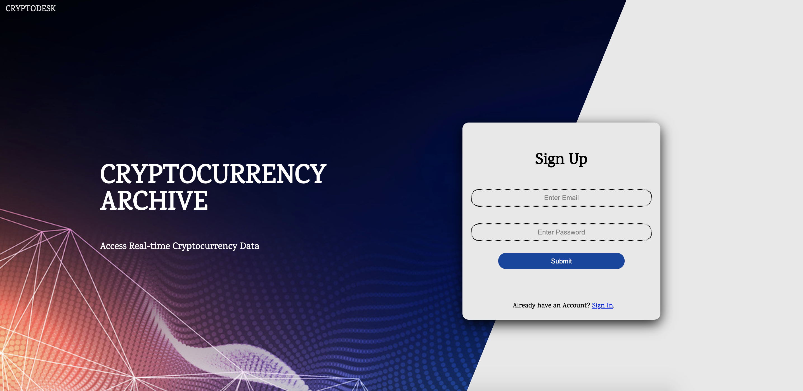

# The Crypt

## Description

```
A mobile responsive Cryptocurrency search engine created with 
JavaScript, Handlebars, Sequelize, Express, Node.js, CryptoCompare API, & Sass 

```
## Table of Contents
  * [Description](#Description)
  * [Deployed Site](#Deployed-Site)
  * [User Story](#User-Story)
  * [Collaborators](#Collaborators)
  * [Presentation](#Presentation)

## Deployed Site

Check it out: 
[The Crypt](https://stark-taiga-10875.herokuapp.com/)




## User Story 

```
As someone who has an interest in the latest cryptocurrency markets
I want to search for any cryptocurrency and see real time data, such as exchange rates, calls per second , & trades per second
So that I can be informed on the latest updates at any given time


```
## Collaborators
* Yesenia Ibarra - https://github.com/YessyIbarra 
* Zach Sattinger - https://github.com/ZachSatt
* Wesley Stroeber  - https://github.com/geekcoreaz 


## Presentation
[The Crypt - Presentation](https://docs.google.com/presentation/d/18GBm2WaT3Y2LfS3tH4ww7h5w2d0Dtx4TJ00ASmVtqHs/edit?usp=sharing)

